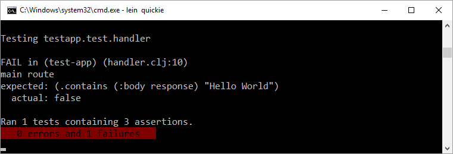
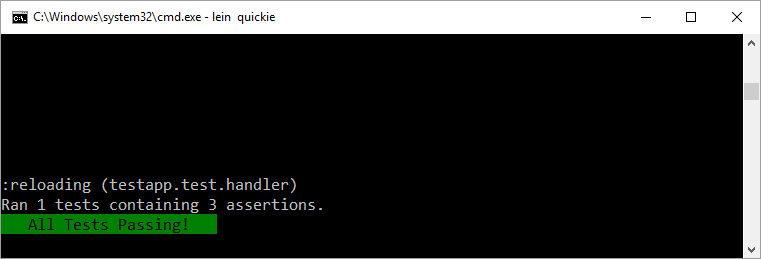

#Tutorial 9 - How **tests** work in clojure
This tutorial will introduce tests to you. So you can use test driven development (TDD) or just use it to test the project.
As you can guess there are limits in automatic testing. Never forget to listen to your users.

- [Test strategies](#test-strategies)
    - [Basics](#basics)
    - [Test WebApps](#test-webapps)
    - [More Tests](#more-tests)

##Test strategies
Testing applications can be a really time consuming part and is same time not a warrant of 0 errors.
Mostly testing is something treated stepmotherly by programmers. Why is that so? 
I am only able to guess about this. Mostly I assume it is the pressure of deadlines instead of quality. If you not heard about this quality takes time and is an opponent of time and money!
Next problem is the "HOW TO" test. Just take a minute and think in testing a webapp or better a 3D game.
You will now encounter the problem that testing can be really difficult in 3D games and in webapps you encounter problems of usability which you can test rarely.
Rarely? Why rarely? There are ways to track usage of certain functions wich allow you measure the times used or time taken to complete a task. This is nearly automatic and is usefull to test different function placements (layout) or other changes vs. old ways (versions) - improvement.

###Basics
Before talking about ideas of testing web pages, I will explain some basics.
Imagine you just wrote a function which will behave as follows:

|Interval|Definition|Output|
|------|------|------|
|(-&#8734;,2)|{x &#8712; Q &#124; x < 2}|0|
|&#91;2,6)|{x &#8712; Q &#124; 2 <= x < 6}|1|
|&#91;6,&#8734;)|{x &#8712; Q &#124; 6 <= x }|2|

Now to the test within Q (rational numbers) you will now write a test between -infinite to +infinite with full granularity. When you are done with it I guess a running time of infinite.
This is where tests have to cover all cases possible and same time be reduced to an acceptable runningtime.
One way to do so is to test all borders which I will explain here. Checking the test coverage can be done by profiling the codes execution coverage by tests.
(I currently do not know a plugin can do this for LT, so if you know one let me know).
Another way of testing would be test driven development. Here you would write tests first and then create the function until the test succeeds.

Back to our test at the border:


As you can see in this sketch we would have to test at 4 points. Let us define the precision of decimals to 3 digits behind comma (1/1000).
So here is our list of tests with results:

1. 1.999 => 0 (T1)
2. 2     => 1 (T2)
3. 5.999 => 1 (T3)
4. 6     => 2 (T4)

That is not all. I said 4 tests, but same time I defined a new condition (3 decimal digits) this will need 2 more tests. What you say about this:

5. 1.9994 => 1.999 => 0
6. 1.9995 => 2 => 1

But what is with 1.99949? Yes, the test above is not really covering all numbers.
What now? Might be the question. Let us have a look to the borders.
The borders are between 3 and 4 decimal digits. So a valid testing should be to test if 3 digits are not rounded and if 4 digits are rounded to 3.
Testing the function used to round? I would test it with the given conditions of test 5 and 6. It can happen that a framework breaks its functionality, so it is better in my personal oppinion to do this basic check if its an important function of your service.

###Test WebApps
Testing WebApps is a little more hard as the outputs are more complex. What you can do easy is to test functions aquire data of the database and check if the results are matching to the view rigths of a user logged in.
Another test would be if all paths you added to be accessible are so when access the app. Or just test if the page contains the output you want it to have. 
The last thing is what we wil do now.
Change `testapp\ test\ testapp\ test\ handler.clj ` by adding `(run-tests) ` at the end of the file and evaluate it by hitting `ctrl+enter `.
You will see the results within the console of LT. If you ask yourself now if thats all you are right, that is not all. 
We are in clojure and there is sure a better way to proceed. In this case we will use quickie, a plugin wich will run tests to us every time we change a file.

Going into `testapp\ project.clj ` and adding `[quickie "0.4.2"] ` to the `:plugins ` section. If you are using windows 10 you do not need to patch ascii colors for the cmd-box.
(In past it was mentioned at quickies page but seems to be removed by using a new coloring lib.)
Now you navigate withing the cmd-box to the project folder (as done with garden before) and run the tests:

```clojure 
lein quickie ;; Single threaded testing
lein quickp  ;; Parallel (multi) threaded testing
```

If you get an error its possible same of garden you added the library to `:dependencies ` instead of `:plugins `?
If no tests are found you will have to define a test-matcher so the plugin knows where to find the tests.
By default all namespaces in your classpath that containing your project name and end with the word "test" will be tested on each run.
Within our project this is a little bit different, we use `(ns testapp.test.handler ` to test our handlers.

```clojure
:test-matcher #"testapp.*\.test\..*"
```

Now quickie will find all tests within our projects namespace "testapp".
Run the test now will create the following output:



This indicates the test failed. The message indicates where it failed so let us fix it.
Changing the file `testapp\ test\ testapp\ test\ handler.clj `:

```clojure
;; change
      (is (.contains (:body response) "Hello World"))))
;; to	  
      (is (.contains (:body response) "Guestbook"))))
```

and run the test again:



###More Tests
If you want some inspiration of how to test or simply how to use tests of libraries look into the test folder of clojure projects here at several different git reps.
[Garden tests are found here](https://github.com/noprompt/garden/tree/master/test/garden) and
tests we will add later of [Ring-Anti-Forgery](https://github.com/weavejester/ring-anti-forgery/tree/master/test/ring) only to mention 2 here.

More about tests I will introduce during the next chapters and show possibilities of testing with the new coming functionality.